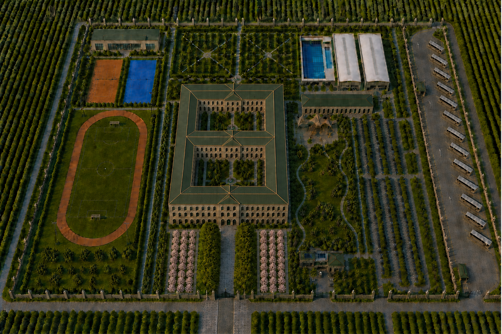
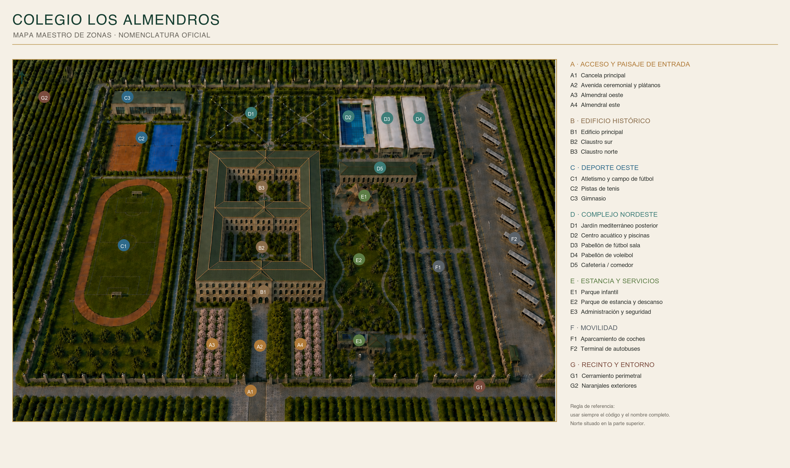
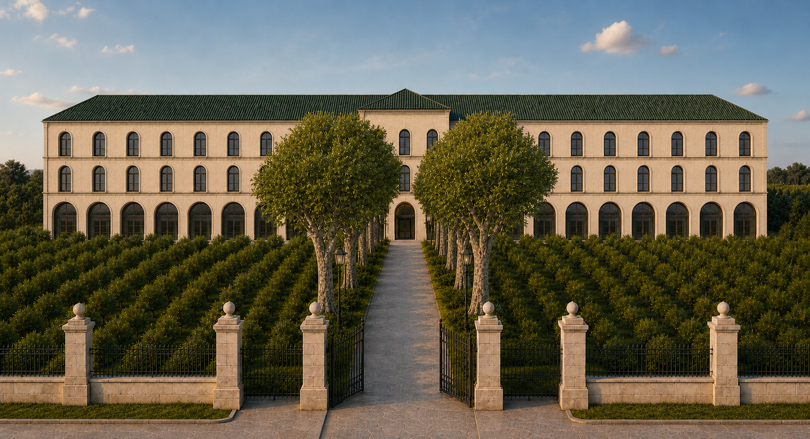
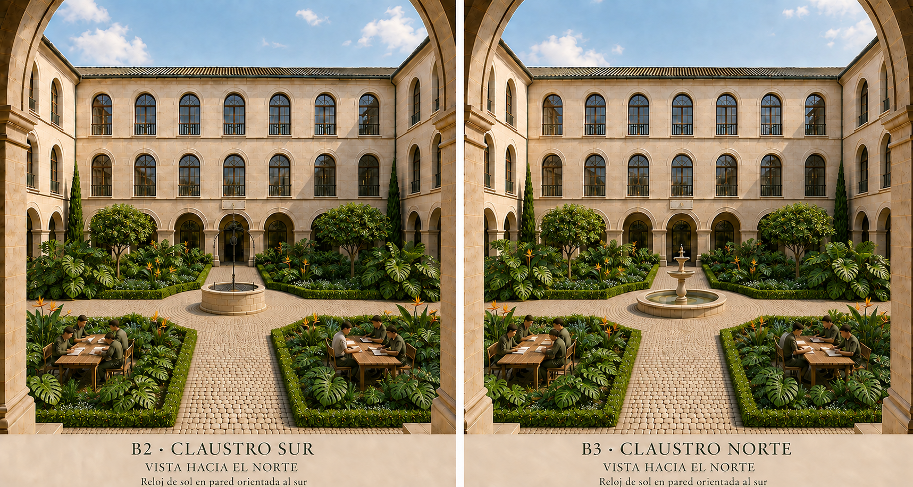

<div align="center">

# Colegio Los Almendros

**Anteproyecto conceptual de un colegio privado en un monasterio valenciano del siglo XVII rehabilitado**




*Vista general v47: el monasterio de dos claustros en el centro, deporte al oeste, complejo acuático al nordeste y terminal de autobuses en el extremo oriental, rodeado por naranjales valencianos.*

</div>

---

## El proyecto

Colegio Los Almendros es un ejercicio de diseño arquitectónico asistido por inteligencia artificial. Parte de un gran monasterio valenciano del siglo XVII y lo transforma en un colegio de dos líneas, 30 grupos y unos 780 alumnos, desde Infantil hasta Bachillerato, respetando la arquitectura histórica exterior e interviniendo de forma contemporánea y reversible en el interior.

Todo el conjunto se rige por un sistema documental que garantiza la coherencia entre imágenes, planos y decisiones. Cada imagen nueva debe respetar un masterplan fijo, unas reglas innegociables y un registro de referencias con estados de vigencia.

### Principios de diseño

| Principio | Concreción |
|---|---|
| **Respeto patrimonial** | Fachadas de piedra caliza restaurada, arquerías de medio punto tipo *riurau*, cubiertas de teja vidriada verde bosque y tres piñones integrados en la cubierta. |
| **Dos claustros** | El edificio principal envuelve dos claustros consecutivos de 30 × 30 m alineados en el eje norte-sur, con caminos adoquinados en cruz, pozo en B2, fuente en B3, relojes de sol y una plantación de porte tropical (monsteras, aves del paraíso y ficus). |
| **Masterplan fijo** | Secuencia oeste-este invariable: deporte, monasterio, parque y administración, complejo acuático, aparcamiento y terminal de autobuses. |
| **Paisaje valenciano** | Naranjales productivos fuera del recinto, almendros en flor flanqueando la avenida de acceso y una alameda de plátanos de sombra. |
| **Cerramiento continuo** | Muro de piedra y verja de forja en todo el perímetro, con la cancela monumental y su escudo calado como pieza de referencia. |

---

## Mapa maestro de zonas

El campus se organiza en 22 zonas con código oficial. Estos códigos se utilizan en prompts, nombres de archivo, decisiones y conversaciones para evitar cualquier ambigüedad.

<div align="center">

</div>

| Grupo | Códigos | Contenido |
|---|---|---|
| **A · Acceso y paisaje** | A1 – A4 | Cancela principal, avenida ceremonial con plátanos y los dos almendrales |
| **B · Edificio histórico** | B1 – B3 | Edificio principal, claustro sur y claustro norte |
| **C · Deporte oeste** | C1 – C3 | Atletismo y fútbol, pistas de tenis y el único gimnasio del campus |
| **D · Complejo nordeste** | D1 – D5 | Jardín mediterráneo, centro acuático, pabellones de fútbol sala y voleibol, cafetería |
| **E · Estancia y servicios** | E1 – E3 | Parque infantil, parque de estancia con 14 bancos, administración y seguridad |
| **F · Movilidad** | F1 – F2 | Aparcamiento de coches y terminal pasante de autobuses |
| **G · Recinto y entorno** | G1 – G2 | Cerramiento perimetral y naranjales exteriores |

Detalle completo en [`documentacion/11_MAPA_MAESTRO_DE_ZONAS.md`](documentacion/11_MAPA_MAESTRO_DE_ZONAS.md).

---

## El edificio principal B1

<div align="center">


*Fachada sur v36: tres plantas, 19 ejes en composición 8 + 3 + 8 y un único arco de acceso.*
</div>

El interior se ha organizado en un programa de **96 estancias** repartidas en tres plantas, cada una con su plano funcional coordinado y su catálogo de imágenes de ambiente.

| Planta | Código | Uso principal | Estancias |
|---|---|---|---:|
| Baja | `B1-PB` | Infantil, Primaria 1.º–2.º, administración, salón de actos y comedor | 36 |
| Primera | `B1-P1` | Primaria 3.º–6.º, biblioteca, arte, música, tecnología y apoyo | 28 |
| Segunda | `B1-P2` | Secundaria, Bachillerato, laboratorios, informática y departamentos | 32 |

<div align="center">


*Claustros B2 y B3 v68: patios de 30 × 30 m con cruce adoquinado, pozo en B2, fuente en B3, relojes de sol y plantación de monsteras, aves del paraíso y ficus (D-030).*
</div>

Planos vigentes: [planta baja](planos/b1-planta-baja-v49.png) · [planta primera](planos/b1-planta-primera-v49.png) · [planta segunda](planos/b1-planta-segunda-v49.png) · [lámina de las tres plantas](planos/b1-programa-tres-plantas-v49.png).

---

## Estructura del repositorio

```
Colegio_Los_Almendros/
├── documentacion/        Sistema documental modular (índice, módulos por zona, decisiones, registro de imágenes)
├── planos/               Planos funcionales de B1 en SVG editable y PNG
├── imagenes/             Referencias visuales organizadas por zona, con sufijo de versión -vNN
├── herramientas/         Scripts Node para generar planos, rotular catálogos y validar el programa
├── PROMPT_ARQUITECTONICO_COLEGIO.md   Prompt histórico original, conservado como registro
├── CHANGELOG.md          Historial de versiones del repositorio
├── LICENSE               Licencia CC BY-NC-SA 4.0
└── CLAUDE.md             Guía de trabajo para asistentes de IA en este repositorio
```

### Sistema documental

La documentación sigue una jerarquía estricta. En caso de contradicción, manda el orden siguiente:

1. [`00_INDICE_Y_REGLAS_MAESTRAS.md`](documentacion/00_INDICE_Y_REGLAS_MAESTRAS.md) y las decisiones vigentes de [`10_CAMBIOS_Y_DECISIONES.md`](documentacion/10_CAMBIOS_Y_DECISIONES.md).
2. El módulo especializado de la zona afectada (`01` a `08`, `01A`, `01B`).
3. El registro de imágenes de [`09_VISTAS_PANELES_Y_REFERENCIAS.md`](documentacion/09_VISTAS_PANELES_Y_REFERENCIAS.md).
4. Las imágenes marcadas como `VIGENTE`.
5. El prompt histórico, solo para recuperar contexto no contradictorio.

Cada imagen del registro tiene un estado: `VIGENTE`, `AUXILIAR`, `PENDIENTE` u `OBSOLETA`. Una versión nueva nunca sobrescribe a la anterior: se añade con un sufijo `-vNN` superior y la antigua pasa a `OBSOLETA`. Un archivo solo se retira por decisión registrada en `10`, eliminando a la vez su fila, su ficha y sus enlaces; toda imagen o plano presente tiene su fila en el registro y el validador comprueba ambas cosas.

Las ediciones concretas de imagen (prompt, modo, límites de uso) se documentan en fichas de versión (`CLAUSTROS_V6x`, `E2_V6x`, `D1_V7x`) enlazadas desde el índice maestro.

---

## Herramientas

Los scripts son módulos ES ejecutados con Node 22 y requieren ImageMagick 7 (`magick`). Se lanzan siempre desde la raíz del repositorio.

```bash
# Valida el proyecto: 96 códigos únicos y planos coherentes, artefactos presentes,
# todos los enlaces (documentación y raíz) válidos y en Unicode NFC, registro de
# imágenes completo, índice completo, IDs de decisión consecutivos y versión máxima
# coherente con este README y CLAUDE.md
node herramientas/validar_b1.mjs

# Regenera los tres planos SVG de B1 a partir de la tabla de estancias
node herramientas/generar_planos_b1.mjs

# Rotula los catálogos de interiores con títulos y etiquetas de códigos
node herramientas/rotular_interiores.mjs

# Compone el panel de patrimonio y bienestar con la pareja de claustros v59
node herramientas/actualizar_claustros_30m.mjs
```

Resultado actual del validador:

```
VALIDACIONES CORRECTAS: 795
RESULTADO B1: APROBADO A NIVEL DE ANTEPROYECTO CONCEPTUAL
```

---

## Flujo para proponer un cambio

1. Identificar la zona afectada con su código oficial, por ejemplo `E2 — Parque de estancia y descanso`.
2. Leer el índice maestro y el módulo correspondiente.
3. Consultar únicamente imágenes `VIGENTE` o `AUXILIAR` autorizadas.
4. Enumerar qué cambia y qué debe permanecer intacto.
5. Generar o editar sin alterar el resto de zonas.
6. Comprobar la lista de aceptación del módulo.
7. Registrar la decisión con un nuevo ID `D-NNN` en el registro de cambios.
8. Registrar cada imagen nueva en `09` con su estado, enlazar la ficha de versión desde el índice y ejecutar el validador.

---

## Estado del proyecto

- **Versión 2.0.0**: retirada de referencias antes vigentes y nueva regla de plantación de los claustros. Historial en [`CHANGELOG.md`](CHANGELOG.md).
- **31 decisiones consolidadas** (`D-001` a `D-031`); D-020 a D-023 fijan relojes de sol, pozo, cruce adoquinado e iluminación de los claustros; D-025 y D-026 redefinen la vegetación de E2 y D1; D-029 retira del proyecto las ediciones v61–v67, v72, v73 y las vistas antiguas del parque; D-030 ratifica la plantación tropical de los claustros.
- **Referencias visuales hasta v75**, con panel exterior de ocho miniaturas, panel interior de 36 escenas, E2 v69–v71 y huerto D1 v74–v75.
- **Anteproyecto conceptual**: las superficies y distribuciones son preliminares y deberán ajustarse tras un levantamiento métrico y estructural del edificio, así como al cumplimiento de la normativa educativa, de incendios y de accesibilidad.

---

## Licencia

**Este repositorio es de uso exclusivamente NO comercial.**

Se publica bajo la licencia [Creative Commons Atribución-NoComercial-CompartirIgual 4.0 Internacional](LICENSE) (CC BY-NC-SA 4.0). Puedes compartir y adaptar la documentación, los planos y las imágenes siempre que cites la autoría, no hagas ningún uso comercial y distribuyas las obras derivadas bajo la misma licencia. Cualquier uso comercial requiere autorización expresa del autor.

---

<div align="center">

Proyecto de **Javier Tamarit** · Imágenes y planos generados con herramientas de inteligencia artificial y ensamblados con ImageMagick

</div>
